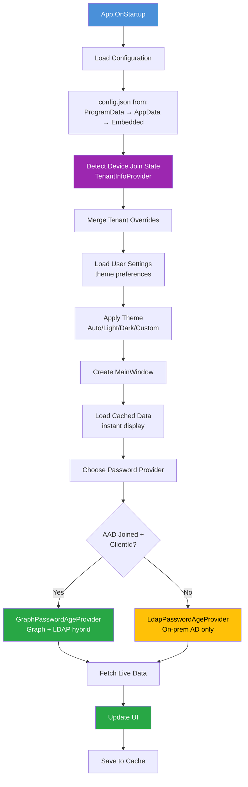
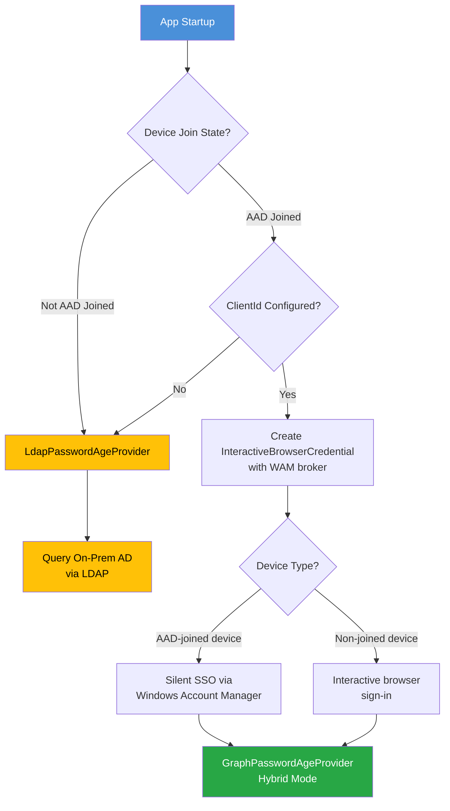
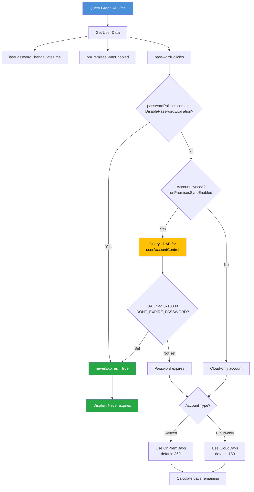
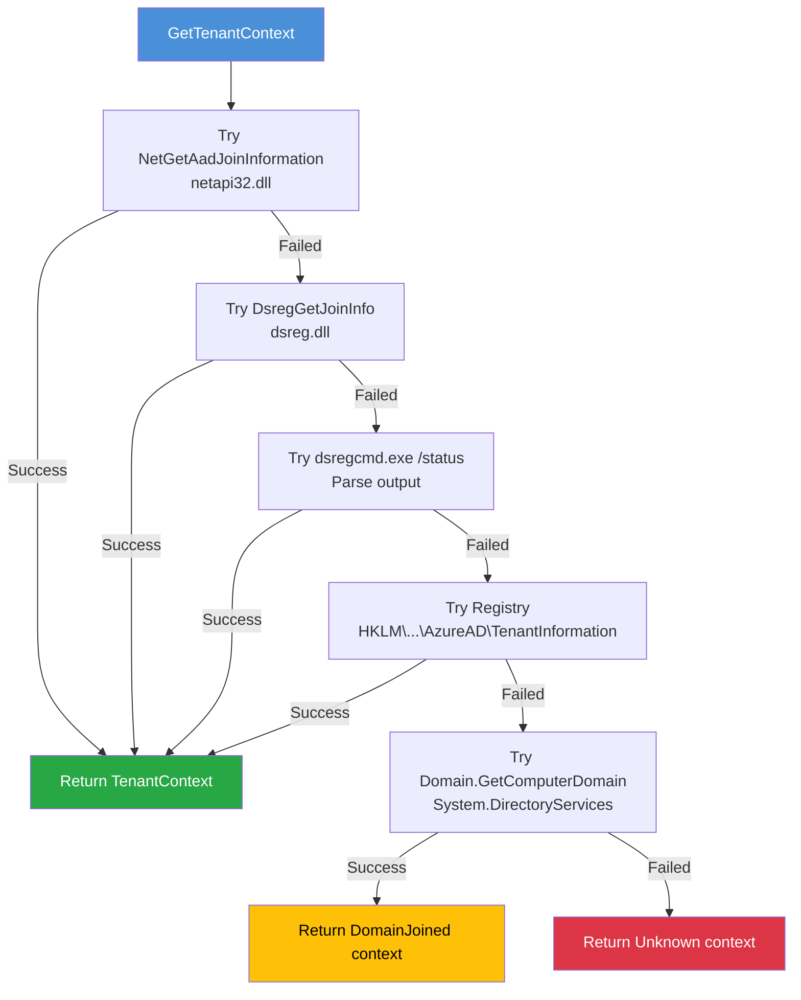

# Information Box – Modern IT Self-Service for Windows

Information Box is available as portable EXE builds from GitHub Releases (no MSIX required).

### Project Information
[](https://github.com/EvotecIT/InformationBox/actions/workflows/ci.yml)
[](https://codecov.io/gh/EvotecIT/InformationBox)
[](https://github.com/EvotecIT/InformationBox/releases)
[](https://github.com/EvotecIT/InformationBox/releases)
[](https://github.com/EvotecIT/InformationBox)
[](https://github.com/EvotecIT/InformationBox)
[](https://github.com/EvotecIT/InformationBox)

### Author & Social
[](https://twitter.com/PrzemyslawKlys)
[](https://evotec.xyz/hub)
[](https://www.linkedin.com/in/pklys)
[](https://www.threads.net/@przemyslaw.klys)
[](https://evo.yt/discord)

Modern, secret-free IT self-service desktop app for Windows. Shows device/account/network status, warns about password expiry, exposes tenant-aware quick links, and ships with built-in “Fix” actions for common end-user issues. Portable-friendly, multi-tenant, and themeable.

## Contents
- [Highlights](#highlights)
- [Build & Run](#build--run)
- [Deployment Flavors](#deployment-flavors)
- [Configuration Overview](#configuration-overview)
- [Branding](#branding)
- [Layout & Placement](#layout--placement)
- [Feature Flags](#feature-flags)
- [Links, Zones, and Local Sites](#links-zones-and-local-sites)
- [Fix Actions](#fix-actions)
- [Password Policy](#password-policy)
- [Tenant Overrides](#tenant-overrides)
- [Development & Tests](#development--tests)
- [License](#license)

## Highlights
- Cross-tenant, secret-free: works with Graph when available, degrades gracefully offline/LDAP.
- Built-in dense mode (default) for compact UI; configurable window size/placement per tenant.
- “Fix” tab ships with typed, AOT-friendly built-ins (OneDrive/Teams/VPN/Store/logs, etc.) that can be enabled/hidden/overridden via config.
- Themeable (Auto/Light/Dark/Classic/Ocean/Forest/Sunset) with white-label branding.
- Placeholder support in fix commands (`{{SUPPORT_EMAIL}}`, `{{COMPANY_NAME}}`, `{{PRODUCT_NAME}}`).
- Portable deployment: single-contained, single-fx, portable, and fx outputs from one script.

## Build & Run

```powershell
# Restore
dotnet restore

# Debug build
dotnet build InformationBox/InformationBox.csproj -c Debug

# Release publish (no MSIX)
dotnet publish InformationBox/InformationBox.csproj -c Release
```

## Deployment Flavors

`pwsh Build/Deploy.ps1` produces ready-to-ship artifacts in `Artefacts/`:

| Folder              | What you get                                | Needs .NET? |
| ------------------- | ------------------------------------------- | ----------- |
| `portable/`         | Self-contained, loose files                 | No          |
| `single-contained/` | Self-contained, single-file style           | No          |
| `single-fx/`        | Framework-dependent, compressed single file | Yes         |
| `fx/`               | Framework-dependent, loose files (smallest) | Yes         |

## Configuration Overview
- Load order: `--config <path>` (future) → `C:\ProgramData\InformationBox\config.json` → `%APPDATA%\InformationBox\config.json` → embedded `Assets/config.default.json`.
- User preferences (theme, etc.) persist in `%LOCALAPPDATA%\InformationBox\settings.json`.
- Dense mode is the default; all layout options are configurable.

### Sample skeleton
```json
{
  "branding": { "productName": "Information Box", "supportEmail": "support@example.com" },
  "layout": { "defaultWidth": 680, "defaultHeight": 440, "denseMode": true },
  "featureFlags": { "showLocalSites": true, "showContacts": true, "showHelp": true, "showHealth": false },
  "links": [],
  "zones": [],
  "localSites": [],
  "contacts": [],
  "passwordPolicy": { "onPremDays": 360, "cloudDays": 180 },
  "fixes": [],
  "tenantOverrides": {},
  "auth": { "clientId": "" }
}
```

## Branding

```json
"branding": {
  "productName": "Information Box",
  "companyName": "Evotec",
  "primaryColor": "#0050b3",
  "secondaryColor": "#e5f1ff",
  "logo": "Assets/logo.png",
  "logoWidth": 0,
  "logoHeight": 40,
  "icon": "Assets/app.ico",
  "theme": "Auto",
  "supportEmail": "support@example.com"
}
```

| Property       | Default             | Notes                                       |
| -------------- | ------------------- | ------------------------------------------- |
| `productName`  | Information Box     | Window title / header text                  |
| `companyName`  | Evotec              | Shown under the header                      |
| `logo`         | Assets/logo.png     | PNG recommended; `logoWidth=0` auto-scales  |
| `logoHeight`   | 40                  | Height in px                                |
| `icon`         | Assets/app.ico      | Window/taskbar icon                         |
| `theme`        | Auto                | Auto/Light/Dark/Classic/Ocean/Forest/Sunset |
| `supportEmail` | support@contoso.com | Used by email/log collection actions        |

## Layout & Placement

```json
"layout": {
  "startMinimized": false,
  "defaultWidth": 680,
  "defaultHeight": 440,
  "horizontalAnchor": "Right",
  "verticalAnchor": "Bottom",
  "offsetX": 0,
  "offsetY": 0,
  "preferredCorner": "BottomRight",
  "multiMonitor": "Active",
  "trayOnly": false,
  "minimizeOnClose": true,
  "denseMode": true,
  "maxContentWidth": 0
}
```

| Property              | Default | Description                                      |
| --------------------- | ------- | ------------------------------------------------ |
| `defaultWidth`        | 680     | Initial window width                             |
| `defaultHeight`       | 440     | Initial window height                            |
| `horizontalAnchor`    | Right   | Left / Center / Right                            |
| `verticalAnchor`      | Bottom  | Top / Center / Bottom                            |
| `offsetX` / `offsetY` | 0       | Pixel offsets from anchor                        |
| `multiMonitor`        | Active  | Active / Primary / DisplayIndex                  |
| `trayOnly`            | false   | Hide main window; run only from tray             |
| `minimizeOnClose`     | true    | Close/X hides to tray instead of exiting         |
| `denseMode`           | true    | Tighter padding/spacing                          |
| `maxContentWidth`     | 0       | Cap content width (0 = no cap)                   |

## Feature Flags

```json
"featureFlags": {
  "showLocalSites": true,
  "showHelp": true,
  "showContacts": true,
  "showHealth": false
}
```

## Links, Zones, and Local Sites

```json
"links": [ { "name": "Create Ticket", "url": "https://helpdesk.example.com", "section": "Support", "visible": true, "order": 1 } ],
"zones": [ { "domain": "corp.example.com", "zone": "HQ" } ],
"localSites": [ { "label": "Intranet", "url": "https://intranet.example.com", "zone": "HQ", "visible": true, "order": 1 } ],
"contacts": [ { "label": "IT Service Desk", "email": "servicedesk@example.com", "phone": "+1-800-555-0100" } ]
```

- Zones resolve from `USERDNSDOMAIN`; Local Sites are auto-filtered by current zone.

## Fix Actions

Typed, override-friendly model. Leave `command` empty to reuse the built-in script; set `visible: false` to hide.

```json
"fixes": [
  {
    "id": "restart-onedrive",
    "name": "Restart OneDrive",
    "description": "Close and restart OneDrive sync client",
    "category": "OneDrive",
    "command": "",
    "confirm": "OneDrive will be restarted. Continue?",
    "visible": true,
    "order": 1
  }
]
```

Built-ins (override by `id`):

| ID                         | Description                                  |
| -------------------------- | -------------------------------------------- |
| restart-onedrive           | Restart OneDrive sync client                 |
| reset-teams-cache          | Clear Microsoft Teams cache                  |
| clear-edge-cache           | Open Edge cache clear dialog                 |
| clear-chrome-cache         | Open Chrome cache clear dialog               |
| wsreset                    | Reset Microsoft Store cache                  |
| collect-logs               | Collect diagnostics to Desktop zip           |
| email-logs                 | Collect logs, open mailto to support         |
| reset-vpn-adapter          | Toggle VPN adapters                          |
| repair-outlook-teams-addin | Re-register Teams meeting add-in for Outlook |

Placeholders inside commands:
- `{{SUPPORT_EMAIL}}`
- `{{COMPANY_NAME}}`
- `{{PRODUCT_NAME}}`

## Password Policy

```json
"passwordPolicy": {
  "onPremDays": 360,
  "cloudDays": 180
}
```

## Tenant Overrides

```json
"tenantOverrides": {
  "tenant-guid-here": {
    "branding": { "productName": "Client Portal", "supportEmail": "support@client.com" },
    "layout": { "defaultWidth": 720, "denseMode": true }
  }
}
```

## Technical Architecture

### Application Startup Flow



### Authentication & Microsoft Graph Integration

#### Azure AD App Registration Setup

To enable Graph API integration for enhanced user profile and password status:

1. **Register Application** in Azure Portal > Azure Active Directory > App registrations
2. **Configure Redirect URI**: Set "Public client/native" with URI:
   ```
   https://login.microsoftonline.com/common/oauth2/nativeclient
   ```
3. **Enable Public Client**: Set "Allow public client flows" to **Yes**
4. **Add Permission**: Microsoft Graph > Delegated > `User.Read`
5. **Grant Admin Consent** (recommended for seamless deployment)
6. **Copy Client ID** to `config.json`:
   ```json
   { "auth": { "clientId": "YOUR-CLIENT-ID-HERE" } }
   ```

#### Authentication Flow



**Key Files:**
- `App.xaml.cs` - Entry point, provider selection (`ChoosePasswordProviderAsync`)
- `Services/GraphLiteClient.cs` - Lightweight Graph API client
- `Services/TenantInfoProvider.cs` - Device join detection

#### Security Model

| Aspect               | Implementation                                 |
| -------------------- | ---------------------------------------------- |
| **Permission Scope** | `User.Read` (delegated) - minimal privilege    |
| **Token Storage**    | Azure.Identity handles secure caching          |
| **Authentication**   | Public client flow (no secrets in code)        |
| **SSO**              | Windows Account Manager for AAD-joined devices |

### Password Expiration Detection

#### Provider Selection Logic

| Device State                 | Provider                   | Notes                         |
| ---------------------------- | -------------------------- | ----------------------------- |
| Azure AD Joined + ClientId   | `GraphPasswordAgeProvider` | Hybrid: Graph + LDAP fallback |
| Azure AD Joined, no ClientId | `LdapPasswordAgeProvider`  | On-prem only                  |
| Domain Joined only           | `LdapPasswordAgeProvider`  | On-prem only                  |
| Not joined                   | None                       | No password detection         |

#### Hybrid Password Detection (Graph + LDAP)

For organizations using Azure AD Connect, the app performs **hybrid detection**:



**Why Hybrid Detection?**
Azure AD's `passwordPolicies` often doesn't reflect the on-premises AD "Password never expires" checkbox for synced accounts. The hybrid approach ensures accurate detection by checking both sources.

**Key Files:**
- `Services/GraphPasswordAgeProvider.cs` - Hybrid provider with LDAP fallback
- `Services/LdapPasswordAgeProvider.cs` - Pure LDAP provider

#### LDAP UAC Flag Reference

The `userAccountControl` attribute contains account flags:

| Flag                   | Value             | Meaning                |
| ---------------------- | ----------------- | ---------------------- |
| `DONT_EXPIRE_PASSWORD` | `0x10000` (65536) | Password never expires |

```csharp
// Detection code
const int DontExpire = 0x10000;
var neverExpires = (uac & DontExpire) == DontExpire;
```

### Device Join Detection

`TenantInfoProvider` uses multiple detection methods with automatic fallback:



**Detection Methods (in priority order):**

| #   | Method     | API/Source                                          | Best For                    |
| --- | ---------- | --------------------------------------------------- | --------------------------- |
| 1   | Native API | `NetGetAadJoinInformation` (netapi32.dll)           | AAD-joined devices, fastest |
| 2   | dsreg.dll  | `DsregGetJoinInfo`                                  | Windows 10+ fallback        |
| 3   | dsregcmd   | Parse `/status` output                              | When DLLs unavailable       |
| 4   | Registry   | `HKLM\SOFTWARE\Microsoft\AzureAD\TenantInformation` | Persistent storage fallback |
| 5   | AD Domain  | `Domain.GetComputerDomain()`                        | Domain-only devices         |

**Join Types:**

| Type                  | Description          |
| --------------------- | -------------------- |
| `AzureAdJoined`       | Direct Azure AD join |
| `HybridAzureAdJoined` | Both AD and Azure AD |
| `DomainJoined`        | On-premises AD only  |
| `WorkplaceJoined`     | BYOD scenario        |

### Troubleshooting Command Execution

The `CommandRunner` service executes PowerShell commands with two execution modes:

```mermaid
flowchart TD
    subgraph Standard["Standard Execution (RunAsync)"]
        A1[Start PowerShell<br/>-NoProfile -ExecutionPolicy Bypass] --> A2[Redirect stdout/stderr]
        A2 --> A3[Real-time output<br/>via callback]
        A3 --> A4{Process completed?}
        A4 -->|Yes| A5[Return CommandResult]
        A4 -->|Timeout/Cancel| A6[Kill process tree]
        A6 --> A7[Return cancelled result]
    end

    subgraph Elevated["Elevated Execution (RunAsAdminAsync)"]
        B1[Start PowerShell<br/>Verb = runas] --> B2[UAC Prompt]
        B2 -->|Approved| B3[Execute command]
        B2 -->|Denied| B4[Return cancelled]
        B3 --> B5[Write output to<br/>temp file]
        B5 --> B6[Read temp file]
        B6 --> B7[Return CommandResult]
    end

    style A1 fill:#4a90d9,color:#fff
    style B1 fill:#ffc107,color:#000
    style A5 fill:#28a745,color:#fff
    style B7 fill:#28a745,color:#fff
    style B4 fill:#dc3545,color:#fff
```



#### Standard Execution (`RunAsync`)
- Runs as current user (no elevation)
- Real-time output streaming via `onOutput` callback
- 5-minute timeout with cancellation support
- Process tree termination on cancel

#### Elevated Execution (`RunAsAdminAsync`)
- Triggers UAC prompt (`Verb = "runas"`)
- Output captured via temp file (elevated process limitation)
- Graceful handling of UAC cancellation (error code 1223)

**Key File:** `Services/CommandRunner.cs`

### Log Location

```
%APPDATA%\InformationBox\logs\log.txt
```

Contains: authentication events, provider selection, LDAP queries, command execution results.

## Development & Tests
- Target framework: `net10.0-windows` (WPF).
- Solution: `InformationBox.sln` (app) + `InformationBox.Tests` (xUnit).
- Run tests: `dotnet test InformationBox.Tests/InformationBox.Tests.csproj`.
- CI: `.github/workflows/ci.yml` (restore, build, test, coverage; Codecov upload optional via `CODECOV_TOKEN` secret).

### Project layout
```
InformationBox/
├─ Assets/            # logo, icon, default config
├─ Config/            # strongly-typed config records & enums
├─ Services/          # Graph/LDAP/device helpers
├─ Themes/            # XAML theme resources
├─ UI/                # ViewModels, commands, components
├─ App.xaml           # app entry
└─ MainWindow.xaml    # main shell
```

## License

Copyright (c) Evotec. Refer to the repository license information for details.
